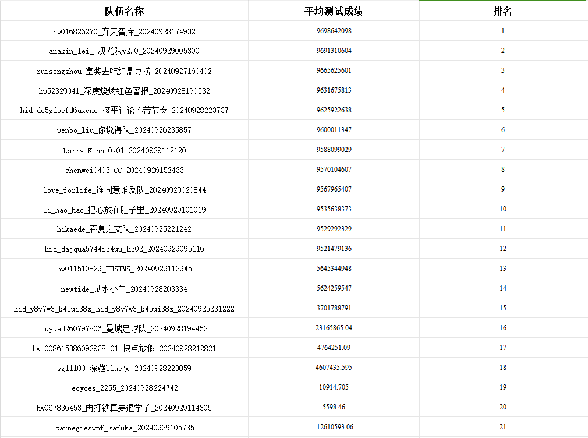
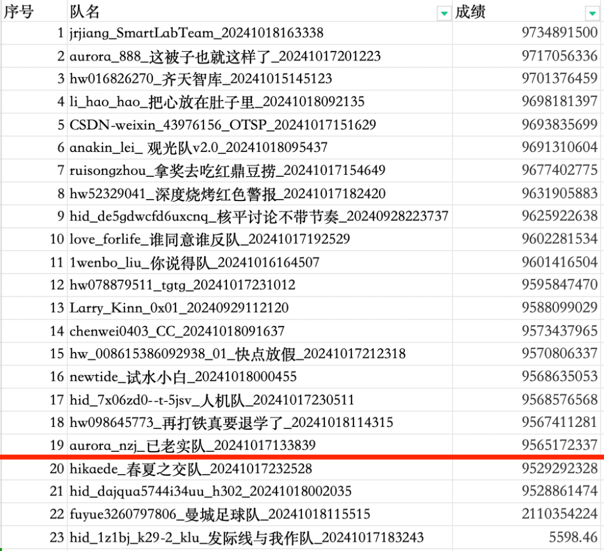

## 8.21

- 强化学习的方法（×）
  - 传IO序号没有意义（×）
  - 磁盘调度不是马尔科夫过程

- IO序列特点
  - 位置分布：lops, wrap
  - 长度：可能和电机加速度有关

- 思路
  - 根据IO特点分类
  - 电梯优化/最近邻优化/最近邻+电梯
  - 结合启发式（<20s的迭代条件）

## 8.29

**【最近邻的优化思路】**

1. 初始位置选择
   - 对IO按位置预排序（lops），选择离磁头最近的/lops最小的
   - 方向：如果磁头有惯性方向，可以优先考虑该方向上的
2. 查找相关论文，和遗传算法、粒子群等结合
   - 同时考虑后续多个请求，而不是每次只考虑当前请求的最优解，避免长距离移动
   - 最近邻作初始解

**【其他】**

- merge、最近邻、SCAN等算法时间都很短，可以都运行取最优
- 关于wrap、lops的seekT规律：可以用于优化merge算法

**【分工】**

- lfr：探索强化学习，大概2周
- wzj：merge、SCAN算法优化
- xjh：最近邻优化

## 9.22

**【分工】**

- [ ] 生成测试样例：高斯 + 随机：wzj
- [ ] 优化cost、整体算法、优化算子接口：lfr
- [ ] mpscan* + partition：xjh
- [ ] merge 堆的优化 + partition：gxj

**【其他】**

- 下次开会：26晚上
- 其他思考方向：蒙特卡洛搜索

## 9.26

**【讨论结果】**

- cmake list 优化
- 文档：改成框架式的
- 代码：整理一版，pscan和merge都跑一遍，选取最优的
- 后续优化思路：LOSS...
- 下次讨论：暂定 **28 号 14:30**

**【设计文档】**

- 方案设计：系统架构设计、设计原理（大的框图、IO特性感知）

- 关键代码说明：基础数据结构、调度算法（merge、pscan）、算子优化

- 测试及分析：环境配置、数据集（生成的和赛题给的）、方法、结果（柱状图）

**【分工】**

- [ ] wzj：合并提交代码；文档的测试分析部分
- [ ] gxj：文档的方案设计、关键代码说明的 merge 部分
- [ ] xjh：文档的关键代码说明部分
- [ ] lfr：文档的方案设计部分

## 9.28

**【文档修改】**

- 统一名称：PartitionScan、Merge
- Merge的具体原理图、数据结构

- 设计部分：PartitionScan原理图（SORT、Scan、MPScan、MPScan* 用论文的图）、采用以上两种方法的原因（举例说明）
- 主框图：表现出先分区、每个区域内实现Scan

## 10.27

**【初赛第一轮】**

**【初赛第二轮】**

**【时间】**

决赛第一轮：==2024年10月25日0时 - 2024年11月1日12时==

决赛第二轮：==2024年11月6日0时 - 2024年11月15日12时==

决赛&颁奖仪式：==2024年12月13日 - 2024年12月14日==

**【优化】**

1. 优化merge

   - 选路径时避免成环，导致最后选出来的边非常长。

   - 选IO时，初始点没有选择。

2. ==基础结果+元启发式算法==
   - 迭代时间很久、内存要很小
   - 模拟退火、蚁群、遗传
   - 算子优化：交换一些边和点

3. ==代价加上磨损==
4. 并行
5. 编译
   - 用些库和lib执行
6. 执行时间、预算时间记录

**【分工】**

先在submit里改

- [ ] wzj：元启发式算法，保存结果
- [ ] xjh：代价加上磨损（pscan先不考虑
- [ ] gxj：记录执行时间和预算
- [ ] lfr：并行，2个线程